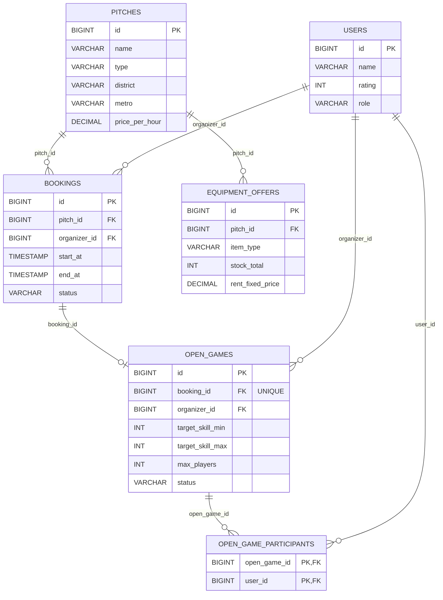

# ER Diagram

```mermaid
erDiagram
    USERS {
        BIGINT id PK
        VARCHAR name
        INT rating
        VARCHAR role
    }

    PITCHES {
        BIGINT id PK
        VARCHAR name
        VARCHAR type
        VARCHAR district
        VARCHAR metro
        DECIMAL price_per_hour
    }

    BOOKINGS {
        BIGINT id PK
        BIGINT pitch_id FK
        BIGINT organizer_id FK
        TIMESTAMP start_at
        TIMESTAMP end_at
        VARCHAR status
    }

    OPEN_GAMES {
        BIGINT id PK
        BIGINT booking_id FK "UNIQUE"
        BIGINT organizer_id FK
        INT target_skill_min
        INT target_skill_max
        INT max_players
        VARCHAR status
    }

    EQUIPMENT_OFFERS {
        BIGINT id PK
        BIGINT pitch_id FK
        VARCHAR item_type
        INT stock_total
        DECIMAL rent_fixed_price
    }

    OPEN_GAME_PARTICIPANTS {
        BIGINT open_game_id PK, FK
        BIGINT user_id PK, FK
    }

    PITCHES ||--o{ BOOKINGS : "pitch_id"
    USERS ||--o{ BOOKINGS : "organizer_id"
    PITCHES ||--o{ EQUIPMENT_OFFERS : "pitch_id"
    BOOKINGS ||--o| OPEN_GAMES : "booking_id"
    USERS ||--o{ OPEN_GAMES : "organizer_id"
    OPEN_GAMES ||--o{ OPEN_GAME_PARTICIPANTS : "open_game_id"
    USERS ||--o{ OPEN_GAME_PARTICIPANTS : "user_id"
```
